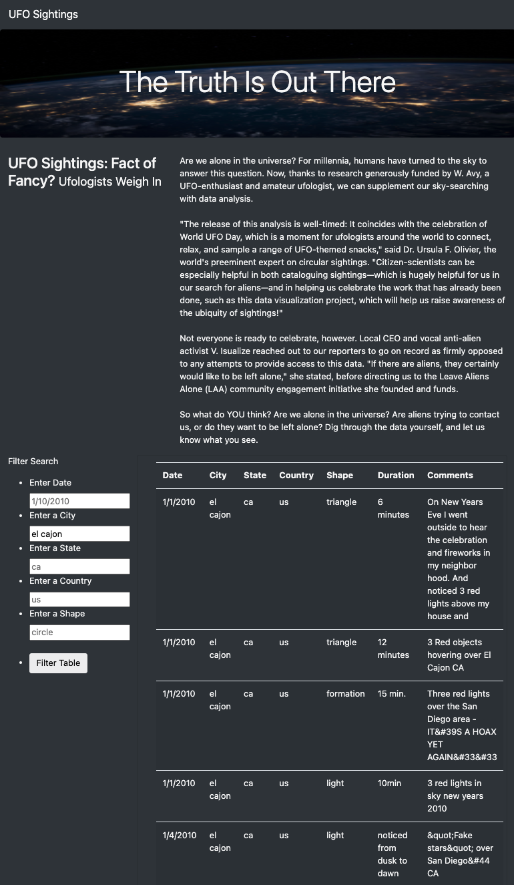

# UFOs

## Overview of Analysis

The purpose of this project is to display UFO sightings and information on a webpage with a dynamic table. This analysis will focus creating an HTML page that will summarize an article, the table of data, and easy to use filters to fine tune the results based on date, city, state, country and shape. 

## Results

The data preparation utilizes Javascript and HTML to analyze and create webpage and a dynamic table with filters. The webpage is generated on the <a href="index.html">index HTML webpage file</a>. 

The webpage is created by altering the <a href="static/js/data.js">data</a> to make an <a href="static/js/app.js">application</a>. The webpage also utilizes <a href="static/css/style.css">CSS</a> to make it easy to read and more aesthetic.  

### Overview of Webpage

The webpage is extremely dynamic and has various features. In the webpage, there are 4 key features to highlight:

**1. Header**

The header "The Truth Is Out" stands out due to the size of font, as well as the image in the back. This allows the audience to quickly be captivated and understand what the webpage is about.

**2. The Article**

The article is quickly summarized on the webpage with the header, as well as the content.

**3. The Table**

The Javascript dataset is converted into an easy to read table that highlights the date, city, state, country, shape, duration of sighting and any comments. 

**4. Filter Search**

This filter serach function loops through the dataset and keep only the results that match the search criteria. This provides a more in-depth analysis of UFO sightings by allowing users to filter for multiple criteria at the same time.

The sample on the right showcases us filtering for the city "El Cajon". 

## Summary

### Drawbacks

A current drawback about this webpage is that the filtering function requires you to write exactly what is in the dataset. For example, if you were to write "El Cajon", our system will not be able to filter it. Instead, you would need to write "el cajon" so it matches our dataset. In order to make it more dynamic, it would be recommended to accept any filter that is similar to the dataset.

### Recommendations

1. The first recommendation would be an export function for the table. This can allow users to export the specific filters and utilize the data to their needs. For example, to create their own datasets or their own specific webpages. 

2. The second recommendation would be to clean up the dataset, for example, in the duration section, each duration is written differently. From "6 minutes" to "15 min." to "10min". This can be hard to run any future reports or to create better analysis. 
